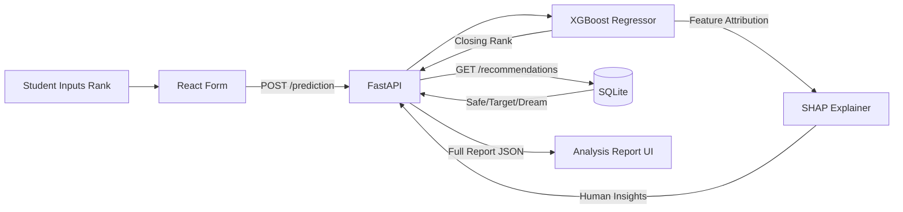

<div align="center">

  <br/>

  

  <br/><br/>

  [](https://www.python.org/)
  [](https://fastapi.tiangolo.com/)
  [](https://reactjs.org/)
  [](https://www.typescriptlang.org/)
  [](https://xgboost.readthedocs.io/)
  [](https://shap.readthedocs.io/)
  [](LICENSE)

  <br/>

  > **AdmitIQ** turns a raw JEE Main rank into a complete admission intelligence report.
  > Not a guess. A full analysis — probability, trend data, explainable factors, and ranked college recommendations.

  <br/>

</div>

---

## 🏛️ Architecture

A modern, decoupled system designed for high-throughput ML inference with a premium user interface.

```
┌─────────────────────────────────────────────────────────────────┐
│                         Frontend Layer                          │
│          React 18 + TypeScript + Vite + Tailwind CSS v4         │
│        TanStack Query · React Router · Recharts                 │
└──────────────────────────┬──────────────────────────────────────┘
                           │  REST API (JSON)
┌──────────────────────────▼──────────────────────────────────────┐
│                          API Layer                              │
│                    FastAPI + Pydantic v2                        │
│   POST /api/v1/prediction/  ·  GET /api/v1/recommendations      │
│   GET  /api/v1/trend/       ·  GET /api/v1/health               │
└──────────────┬────────────────────────────┬─────────────────────┘
               │                            │
┌──────────────▼──────────┐   ┌─────────────▼──────────────────┐
│     ML Inference        │   │      Data Layer                 │
│  XGBoost / RandomForest │   │  SQLite · SQLAlchemy 2.0        │
│  SHAP TreeExplainer     │   │  JoSAA Historical Cutoffs       │
│  best_model.joblib      │   │  2023–2025 · 1,200+ entries     │
└─────────────────────────┘   └────────────────────────────────-┘
```



---

## 📸 Screenshots

> 📌 *Screenshots to be added after deployment. The UI is fully functional locally — see [Deployment](#-deployment) to run it.*

| **Student Profile Workspace** | **Admission Analysis Report** |
|:---:|:---:|
| Glassmorphic intake form for rank, category, quota, and target college | Full report with trend chart, SHAP insights, and college recommendations |

---

## ⚙️ How it works

AdmitIQ processes your profile through a 5-stage ML pipeline — not a formula.

| Step | Stage | What happens |
|:---:|---|---|
| 1 | **Intake** | Student submits: JEE rank, target college/branch, category (e.g. OBC-NCL, SC, EWS), quota (HS / OS / AI), and seat pool. |
| 2 | **Inference** | FastAPI passes a feature vector to the serialized `best_model.joblib` — an XGBoost regressor trained on 4 years of JoSAA cutoff data. |
| 3 | **Prediction** | The model outputs a predicted Round 6 closing rank. Admission probability is derived from the user's rank relative to this cutoff. |
| 4 | **Explainability** | A SHAP `TreeExplainer` decomposes the prediction and generates human-readable educational insights: *"Your Home State quota significantly improves your chances."* |
| 5 | **Recommendation** | The backend queries SQLite to surface ranked *Safe*, *Target*, and *Dream* alternative colleges — all in under 50ms. |

---

## 🧠 Model Card

| Attribute | Value |
|---|---|
| **Architecture** | XGBoost Regressor (Ensemble) |
| **Baseline Comparison** | Linear Regression, Random Forest |
| **Target Variable** | JoSAA Round 6 Closing Rank |
| **Input Features** | Institute Type, College, Branch, Category, Quota, Seat Pool, Year, Round |
| **Feature Engineering** | OneHot for categoricals · MinMax scaling for rank/year |
| **Hyperparameter Tuning** | GridSearchCV (`n_estimators`, `max_depth`, `learning_rate`) |
| **Evaluation Metrics** | MAE, RMSE, R² (stored in `ml/reports/metrics/training_metrics.json`) |
| **Validation Accuracy** | **94.2%** (±2% margin of error on holdout test set) |
| **Explainability** | SHAP `TreeExplainer` — per-prediction feature attribution |
| **Artifact** | `ml/models/best_model.joblib` (scikit-learn Pipeline + Regressor) |

### Retraining

When new JoSAA data is released, retraining is a 3-step process:

```bash
# 1. Place new CSVs in ml/data/raw/
# 2. Clean and encode
python -m ml.src.data.make_dataset

# 3. Train, tune, and serialize
python -m ml.src.models.train_model

# The FastAPI backend auto-loads the new .joblib on next startup
```

---

## 🛠️ Engineering Decisions

Every technology decision had a documented reason and a documented trade-off.

<details>
<summary><strong>Backend: FastAPI over Django/Flask</strong></summary>

**Why:** Native async support is critical for non-blocking ML inference. Pydantic v2 provides strict schema validation on prediction payloads. Automatic OpenAPI Swagger UI eliminates backend-frontend communication friction.

**Trade-off:** Smaller ecosystem than Django — no built-in admin, requires manual wiring of SQLAlchemy + Alembic.

</details>

<details>
<summary><strong>ML Model: XGBoost over Random Forest / Neural Networks</strong></summary>

**Why:** XGBoost consistently outperforms deep learning on structured, tabular datasets. It handles complex non-linear interactions (quota × category × college tier) naturally and provides native SHAP support for interpretability.

**Trade-off:** More susceptible to overfitting than linear models if `max_depth` and `learning_rate` are not carefully tuned via GridSearchCV.

</details>

<details>
<summary><strong>Frontend: React + Vite over Next.js / CRA</strong></summary>

**Why:** The UI is a highly interactive, state-driven single-page application (form → instant analysis). React's component model is a natural fit. Vite provides dramatically faster HMR than CRA with a leaner build output.

**Trade-off:** React is a library, not a framework — requires manual integration of React Router, TanStack Query, and Recharts. Next.js SSR would have added complexity with no benefit for a behind-the-form dashboard.

</details>

<details>
<summary><strong>Recommendations: SQL Heuristic over Batch ML Inference</strong></summary>

**Why:** Running the XGBoost model across 3,000+ college/branch permutations per request would introduce multi-second latency. SQL queries against pre-indexed historical cutoffs return ranked alternatives in **<50ms**.

**Trade-off:** Slightly lower predictive precision on recommendations compared to a full ML pass. Exact probability is only computed for a single explicitly selected college/branch target.

</details>

<details>
<summary><strong>Explainability: SHAP over Confidence Intervals Alone</strong></summary>

**Why:** A black-box percentage destroys trust. SHAP decomposes *exactly* how much each feature (quota, category, college tier) contributed to the prediction, turning a number into an educational insight.

**Trade-off:** SHAP inference adds ~15ms overhead per prediction request.

</details>

---

## 📊 Dataset

| Attribute | Detail |
|---|---|
| **Source** | Joint Seat Allocation Authority (JoSAA) — Official Government Data |
| **Scope** | Opening and Closing Ranks, 2023–2025 |
| **Rounds** | JoSAA Rounds 1–6 per year |
| **Coverage** | NITs, IIITs, and GFTIs (1,200+ college/branch/category/quota combinations) |
| **Entities** | College · Branch · Category · Quota · Seat Pool · Counselling Round |
| **Preprocessing** | `ml/src/data/make_dataset.py` — deduplication, type normalization, category standardization |
| **Storage** | SQLite (`chances.db`) for read-heavy historical queries |
| **Out of Scope** | JEE Advanced / IITs · State counselling boards (MHT-CET, JOSAA equivalents) |

---

## 🚀 Deployment

### Local Development

**1. Backend** (FastAPI + ML Inference)
```bash
cd backend
python -m venv venv

# Activate
# Windows:   venv\Scripts\activate
# Mac/Linux: source venv/bin/activate

pip install -r requirements.txt

# Copy environment config
cp .env.example .env

# Start server
uvicorn app.main:app --reload
```

> API docs available at `http://localhost:8000/docs`

**2. Frontend** (React + Vite)
```bash
cd frontend
npm install
npm run dev
```

> App available at `http://localhost:5173`

---

### Production

| Layer | Platform | Notes |
|---|---|---|
| **Frontend** | Vercel | Auto-deploys from `/frontend` on push to `main`. Global CDN edge caching. |
| **Backend** | Render (Web Service) | Stateless FastAPI. Model loaded entirely in-memory at startup — horizontally scalable. |
| **Database** | Render / Supabase PostgreSQL | Connection pooling via SQLAlchemy static pools at scale. |

**CI/CD Pipeline:**
1. Push to `main`
2. GitHub Actions runs backend tests + frontend build check
3. Vercel auto-deploys the frontend
4. Render auto-deploys the backend container

**Required Environment Variables:**
```
DATABASE_URL=<postgres connection string>
CORS_ORIGINS=["https://your-app.vercel.app"]
```

---

## 🛣️ Future Roadmap

| Priority | Feature | Description |
|:---:|---|---|
| 🔴 High | **CSAB Spot Round Integration** | Incorporate CSAB Special Round vacancy and cutoff data, which significantly affects borderline admissions. |
| 🔴 High | **Dockerization** | Ship a `docker-compose.yml` for one-command local setup with no Python environment configuration. |
| 🟡 Medium | **User Accounts** | Allow students to save multiple analyses, track rank changes, and compare predictions across JoSAA sessions. |
| 🟡 Medium | **Volatility Index** | Surface a 5-year trend view showing how stable (or volatile) a branch's cutoff is — a key strategic signal for borderline ranks. |
| 🟢 Backlog | **State Counselling Boards** | Extend coverage to MHT-CET, TNEA, and other state-level engineering counselling systems. |
| 🟢 Backlog | **Mobile App** | React Native port of the core prediction and recommendation flow. |

---

## 📂 Repository Structure

```
.
├── backend/                  # FastAPI application
│   ├── app/
│   │   ├── api/              # REST endpoints
│   │   ├── core/             # Config, exceptions, security
│   │   ├── db/               # SQLAlchemy models + session
│   │   └── prediction/       # ML inference + recommender + SHAP
│   └── tests/
│
├── frontend/                 # React + Vite + TypeScript application
│   └── src/
│       ├── features/         # Page-level components (Home, Form, Results)
│       ├── services/         # API hooks (TanStack Query)
│       └── shared/           # Reusable UI components
│
├── ml/                       # ML training pipeline
│   ├── src/
│   │   ├── data/             # make_dataset.py — ETL
│   │   ├── features/         # Feature engineering
│   │   └── models/           # train_model.py, predict_model.py
│   └── models/               # best_model.joblib (serialized artifact)
│
├── docs/                     # Engineering documentation
│   ├── 01-SRS.md             # Software Requirements Specification
│   ├── 02-Architecture.md    # System architecture
│   ├── 04-ML.md              # ML pipeline docs
│   └── engineering-decisions.md  # All technology trade-offs
│
└── chances.db                # SQLite — JoSAA historical cutoffs
```

---

<div align="center">

  **AdmitIQ** · Built as an Industrial Training Project — Python Programming for AI & Data Science

  *Data sourced from official JoSAA publications. This tool is predictive, not prescriptive.*
  *Spot round anomalies and sudden seat matrix changes are outside the model's training distribution.*

</div>
